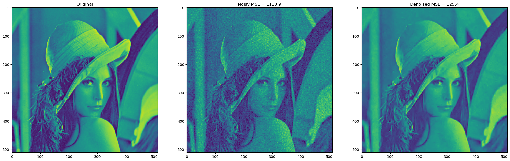

# 2D-DCT-filter

[](https://opensource.org/licenses/MIT)


Overlapping 2D Discrete Cosine Transform matrix (image) filter written in C. The original source of 2D-DCT transform functions (dct.c/h) unknown (from SGN-3057 course, TUT).

</br>

</br>

# Run with
```
g++ -O2 filter.c dct.c -o filter && python addnoise.py && ./filter && python compare.py
```

</br>

Mikael Mieskolainen, 2011
